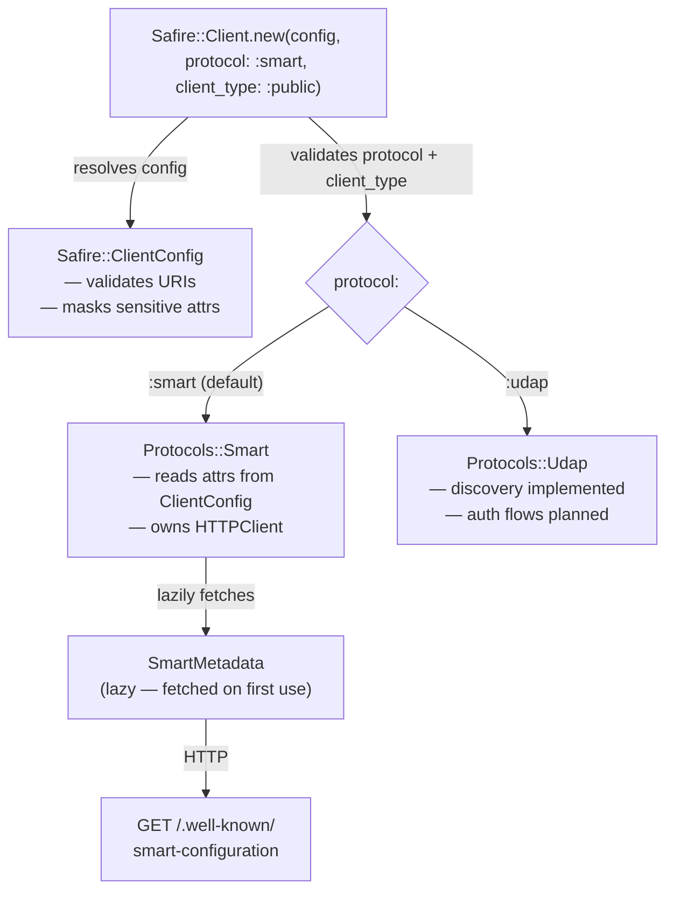

# Configuration

Safire is configured in two places:

- **Client configuration** — the FHIR server URL, credentials, and OAuth parameters passed to `Safire::Client.new`
- **Global configuration** — the logger, log level, and HTTP logging behaviour set once via `Safire.configure`

## Architecture Overview

`Safire::Client` is the public entry point. It owns a `ClientConfig` (validated at construction) and lazily builds a protocol implementation when first used. See [ADR-002]() for the facade design rationale, [ADR-003]() for the `protocol:` / `client_type:` design, and [ADR-006]() for the lazy discovery design.

## Quick Reference

`protocol:` and `client_type:` are keyword arguments to `Safire::Client.new`. All other parameters are keys in the configuration hash (or `Safire::ClientConfig` attributes).

| Parameter | Type | Required | Default | Description |
|-----------|------|----------|---------|-------------|
| `base_url` | String | Yes | — | FHIR server base URL |
| `client_id` | String | No | — | OAuth2 client identifier — required by all authorization flows; validated at call time, not at construction |
| `redirect_uri` | String | No | — | Registered callback URL — required for App Launch flows; not used in Backend Services |
| `protocol:` | Symbol | No | `:smart` | Authorization protocol — `:smart` or `:udap` |
| `client_type:` | Symbol | No | `nil` (→ `:public` for SMART) | SMART client type — `:public`, `:confidential_symmetric`, or `:confidential_asymmetric`; not applicable for `:udap` (any explicit value raises `ConfigurationError`) |
| `client_secret` | String | No | — | Required for `:confidential_symmetric` |
| `private_key` | OpenSSL::PKey / String | No | — | RSA/EC private key; used by SMART asymmetric clients and as the UDAP client signing key |
| `certificate_chain` | Array of PEM strings / OpenSSL::X509::Certificate | No | — | Leaf-first client certificate chain for UDAP software-statement signing |
| `kid` | String | No | — | Key ID matching the public key registered with the server |
| `jwt_algorithm` | String | No | auto | SMART: `RS384` or `ES384`; UDAP registration: `RS256`, `RS384`, `ES256`, or `ES384`, constrained by the key and server metadata |
| `jwks_uri` | String | No | — | URL to client's public JWKS, included as `jku` in JWT header |
| `scopes` | Array | No | — | Default scopes for authorization requests |
| `authorization_endpoint` | String | No | — | Override the discovered authorization endpoint |
| `token_endpoint` | String | No | — | Override the discovered token endpoint |

`certificate_chain` and the UDAP algorithm values are configuration groundwork
for Dynamic Client Registration. The current UDAP runtime supports discovery;
registration is not available yet.

## In This Section

- [Client Setup]({{ site.baseurl }}/configuration/client-setup/) — creating a client, protocol and client type selection, URI rules, and credential protection
- [Logging]({{ site.baseurl }}/configuration/logging/) — global logger setup, HTTP request logging, log levels, and environment variables
