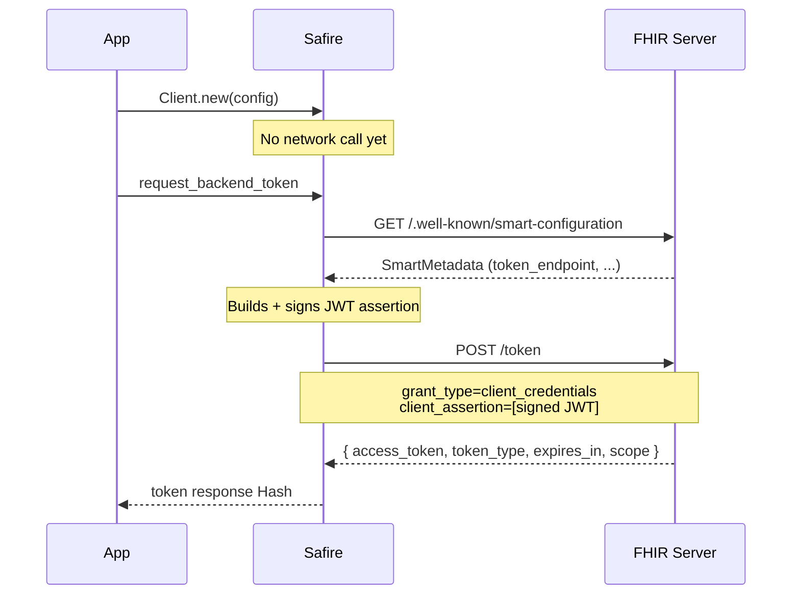

# Token Request

{: .no_toc }

## Table of contents
{: .no_toc .text-delta }

1. TOC
{:toc}

---

## Requesting an Access Token

```ruby
token_data = client.request_backend_token
# => {
#      "access_token" => "eyJhbGci...",
#      "token_type"   => "Bearer",
#      "expires_in"   => 300,
#      "scope"        => "system/Patient.rs system/Observation.rs"
#    }
```

Safire posts to the token endpoint:

```http
POST /token HTTP/1.1
Content-Type: application/x-www-form-urlencoded

grant_type=client_credentials&
scope=system%2FPatient.rs+system%2FObservation.rs&
client_assertion_type=urn%3Aietf%3Aparams%3Aoauth%3Aclient-assertion-type%3Ajwt-bearer&
client_assertion=eyJhbGciOiJSUzM4NCIsImtpZCI6Im15LWtleS1pZCJ9...
```

The JWT assertion structure is identical to the one used in app launch. See [Confidential Asymmetric — Token Exchange](#step-3-token-exchange) for the full claim breakdown.

{: .important }
> No `Authorization` header is sent and no `client_id` appears in the request body — the client identity is carried entirely within the signed JWT assertion.

---

## Scope and Credential Overrides

`scopes`, `private_key`, and `kid` can all be overridden at call time without changing the client configuration:

```ruby
# Override scope only
token_data = client.request_backend_token(scopes: ['system/Patient.rs'])

# Override credentials (e.g. during key rotation)
token_data = client.request_backend_token(
  private_key: OpenSSL::PKey::RSA.new(ENV['NEW_PRIVATE_KEY_PEM']),
  kid:         ENV['NEW_KEY_ID']
)
```

---

## Flow Diagram



{: .note }
> Discovery is lazy — the first call to `request_backend_token` fetches `/.well-known/smart-configuration` to resolve the token endpoint. Subsequent calls reuse the cached metadata. If `token_endpoint` is set directly in `ClientConfig`, discovery is skipped entirely.

---

## Validating the Token Response

Use `token_response_valid?` with `flow: :backend_services` to apply Backend Services compliance checks. This additionally validates that `expires_in` is present, which is required by the Backend Services spec (only recommended for App Launch):

```ruby
token_data = client.request_backend_token

if client.token_response_valid?(token_data, flow: :backend_services)
  access_token = token_data['access_token']
  expires_in   = token_data['expires_in']
else
  # Warnings already logged by Safire — inspect logs for details
  raise 'Non-compliant token response from server'
end
```

---

## Error Handling

```ruby
begin
  token_data = client.request_backend_token
rescue Safire::Errors::ConfigurationError => e
  # private_key or kid missing from config and not passed at call time
  Rails.logger.error("Backend services misconfigured: #{e.message}")
  raise
rescue Safire::Errors::TokenError => e
  case e.error_code
  when 'invalid_client'
    # JWT assertion rejected — wrong key, bad signature, or unrecognized client_id
    Rails.logger.error("Backend services auth rejected: #{e.message}")
  when 'invalid_scope'
    # Server does not allow the requested scopes for this client
    Rails.logger.error("Unauthorized scope: #{e.message}")
  else
    Rails.logger.error("Token request failed: #{e.message}")
  end
  raise
rescue Safire::Errors::NetworkError => e
  # Connection failure, timeout, or SSL error — raised by Safire::HTTPClient
  Rails.logger.error("Network error: #{e.message}")
  raise
end
```

See [Troubleshooting — Confidential Client Errors]() for more detail on `invalid_client` and missing credential errors.

---

## Proactive Token Renewal

Backend services tokens expire (typically in 5–15 minutes) and no refresh token is issued. Track expiry and renew proactively:

```ruby
class BackendTokenManager
  EXPIRY_BUFFER = 60 # seconds

  def initialize(client)
    @client     = client
    @token_data = nil
    @expires_at = nil
  end

  def access_token
    refresh! if needs_refresh?
    @token_data['access_token']
  end

  private

  def needs_refresh?
    @token_data.nil? || Time.now >= (@expires_at - EXPIRY_BUFFER)
  end

  def refresh!
    @token_data = @client.request_backend_token
    @expires_at = Time.now + @token_data['expires_in'].to_i
  end
end

# Usage
manager = BackendTokenManager.new(client)
token   = manager.access_token  # fetches on first call, renews when near expiry
```

For the app launch equivalent (proactive refresh using a refresh token), see [Advanced Examples — Token Management]({{ site.baseurl }}/advanced/#token-management).

---

## Live Testing

Safire includes a live integration spec that exercises the full Backend Services flow against a real server. See `spec/integration/backend_services_live_spec.rb`. Required environment variables:

| Variable | Description |
|----------|-------------|
| `SAFIRE_LIVE_BACKEND_BASE_URL` | FHIR server base URL |
| `SAFIRE_LIVE_BACKEND_CLIENT_ID` | Registered backend client ID |
| `SAFIRE_LIVE_BACKEND_KID` | Key ID matching the registered JWKS |
| `SAFIRE_LIVE_BACKEND_PRIVATE_KEY_PEM` | PEM-encoded private key |
| `SAFIRE_LIVE_BACKEND_SCOPES` | Space-separated scopes (optional; default: `system/*.rs`) |
| `SAFIRE_LIVE_BACKEND_ALGORITHM` | JWT algorithm (optional; default: `RS384`) |

```bash
bundle exec rspec --tag live spec/integration/backend_services_live_spec.rb
```

The [SMART Health IT sandbox](https://launch.smarthealthit.org) supports backend services and can be used for testing without a dedicated FHIR server.

---

**See also:** [Backend Services Overview]() · [Confidential Asymmetric Client]() · [Security Guide]({{ site.baseurl }}/security/) · [Troubleshooting]()
