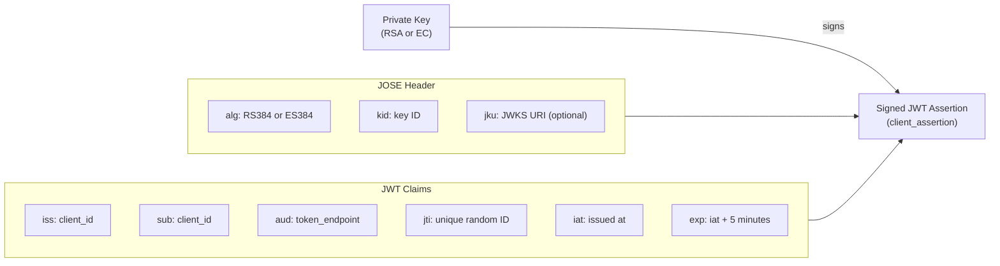

# Confidential Asymmetric Client Workflow

{: .no_toc }

<div class="code-example" markdown="1">
This guide demonstrates SMART on FHIR confidential asymmetric client integration in a **Rails application**. The patterns shown here can be adapted for Sinatra or other Ruby web frameworks.
</div>

---

## Overview

Confidential asymmetric clients authenticate using **`private_key_jwt`** — a signed JWT assertion built from your RSA or EC private key — instead of a shared client secret. This is the most secure SMART client authentication method and is recommended for many production healthcare deployments.

Safire implements `private_key_jwt` per [SMART App Launch STU 2.2.0](https://hl7.org/fhir/smart-app-launch/client-confidential-asymmetric.html).

Suitable for:
- Backend services where sharing a secret out-of-band is impractical
- Multi-tenant platforms where independent key rotation per tenant is valuable
- Deployments requiring the highest level of client authentication assurance

---

## Key Differences from Other Client Types

| Aspect | Public | Confidential Symmetric | Confidential Asymmetric |
|--------|--------|------------------------|-------------------------|
| **Credential** | None | Shared `client_secret` | RSA or EC private key |
| **Token Request Auth** | `client_id` in body | `Authorization: Basic` header | JWT assertion in body |
| **Key Rotation** | N/A | Coordinated secret change | Publish new public key, rotate independently |
| **Algorithms** | N/A | N/A | RS384 or ES384 |
| **PKCE** | Required | Required | Required |

{: .important }
> **PKCE is still required.** The JWT assertion authenticates the *client*; PKCE protects the *authorization code exchange*. They serve different purposes.

---

## Prerequisites: Keys, JWKS, and Algorithm

Before writing any flow code, you need a key pair, a key ID, and a way for the authorization server to verify your public key.

### Generating a Key Pair

```bash
# RSA key (2048-bit minimum, 4096-bit recommended)
openssl genrsa -out private_key.pem 4096
openssl rsa -in private_key.pem -pubout -out public_key.pem

# --- OR ---

# EC key (P-384 curve, required for ES384)
openssl ecparam -name secp384r1 -genkey -noout -out private_key_ec.pem
openssl ec -in private_key_ec.pem -pubout -out public_key_ec.pem
```

Add `*.pem` and `*.key` to `.gitignore`. See the [Security Guide]({{ site.baseurl }}/security/#private-keys-confidential-asymmetric) for loading keys securely in production.

### Publishing Your Public Key (JWKS)

The authorization server must know your public key. Host a JWKS endpoint:

```json
{
  "keys": [
    {
      "kty": "RSA",
      "kid": "my-key-id-123",
      "use": "sig",
      "alg": "RS384",
      "n":   "<base64url-encoded modulus>",
      "e":   "AQAB"
    }
  ]
}
```

If you provide a `jwks_uri` in your Safire config, it is included as the `jku` header in JWT assertions so the server can locate your public key automatically.

### JWT Assertion Structure

Safire builds the following JWT assertion (sent as `client_assertion` in every token request):



### Algorithm Selection

Safire supports the two algorithms required by the SMART specification:

| Algorithm | Key Type | Use Case |
|-----------|----------|----------|
| **RS384** | RSA | Most common, widest server support |
| **ES384** | EC, P-384 curve | Smaller keys, faster signing |

Safire auto-detects the algorithm from the key type — no explicit configuration needed:

```ruby
# RSA key → RS384 automatically
config = Safire::ClientConfig.new(private_key: OpenSSL::PKey::RSA.new(...), kid: 'my-rsa-key', ...)

# EC key → ES384 automatically
config = Safire::ClientConfig.new(private_key: OpenSSL::PKey::EC.generate('secp384r1'), kid: 'my-ec-key', ...)

# Override explicitly if needed
config = Safire::ClientConfig.new(private_key: rsa_key, kid: 'my-key', jwt_algorithm: 'RS384', ...)
```

### Client Setup

```ruby
config = Safire::ClientConfig.new(
  base_url:     ENV['FHIR_BASE_URL'],
  client_id:    ENV['SMART_CLIENT_ID'],
  redirect_uri: callback_url,
  scopes:       ['openid', 'profile', 'patient/*.read', 'offline_access'],
  private_key:  OpenSSL::PKey::RSA.new(File.read(ENV['SMART_PRIVATE_KEY_PATH'])),
  kid:          ENV['SMART_KEY_ID'],
  jwks_uri:     ENV['SMART_JWKS_URI'] # Optional
)

@client = Safire::Client.new(config, client_type: :confidential_asymmetric)
```

---

## What's Next

- [Authorization]() — Discovery and generating the authorization URL
- [Token Exchange & Refresh]() — JWT assertion token requests, refresh, and error handling
- [Security Guide]({{ site.baseurl }}/security/) — Private key management and rotation
- [Advanced Examples]({{ site.baseurl }}/advanced/) — Complete Rails controller, caching, multi-server, and retry patterns