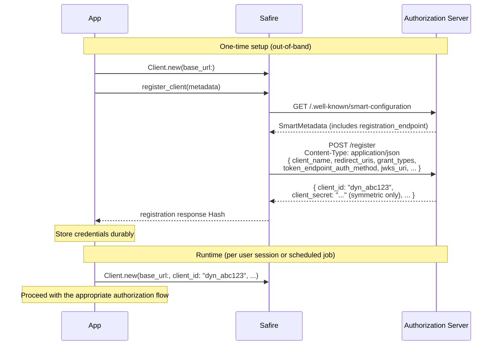

# Dynamic Client Registration
{: .no_toc }

<div class="code-example" markdown="1">
Obtain a `client_id` by registering your application with a SMART authorization server at runtime using the OAuth 2.0 Dynamic Client Registration Protocol (RFC 7591). Safire handles endpoint discovery and metadata submission through `Client#register_client`.
</div>

---

## Overview

Before your application can run any SMART authorization flow, it needs a `client_id`. This is a one-time, out-of-band setup step: the client presents its metadata to the authorization server, and the server issues credentials in return.

The response always includes a `client_id`. For confidential symmetric clients, the server also issues a `client_secret`. For clients using asymmetric authentication (`private_key_jwt`), no secret is issued because the client authenticates with a signed JWT, but the client must include a `jwks_uri` or inline JWKS in its registration metadata so that the server can obtain the client's public keys for verifying those assertions.

There are two ways to accomplish registration:

- **Manual registration** — you register through the server's developer portal, email exchange, or administrative interface, and hard-code the assigned credentials into your configuration.
- **Dynamic Client Registration (RFC 7591)** — your application POSTs its metadata to a registration endpoint at runtime and receives credentials in the response. No portal visit or manual coordination is required.

SMART App Launch 2.2.0 does not mandate DCR. The specification states that "SMART does not specify a standards-based registration process, but we encourage EHR implementers to consider the OAuth 2.0 Dynamic Client Registration Protocol for an out-of-the-box solution." In practice, many servers support manual registration only, while others advertise a `registration_endpoint` in their SMART metadata and accept RFC 7591 requests. Safire implements DCR through [`Client#register_client`]({{ site.baseurl }}/api/Safire/Client.html).

---

## Where Registration Fits in the SMART Flow

Client registration is always Step 1 in the SMART App Launch sequence. It is a one-time prerequisite that happens separately from the runtime authorization interaction.

```
1. Registration  — obtain credentials out-of-band (DCR or manual)
2. Discovery     — fetch /.well-known/smart-configuration (lazy: on first auth call)
3. Authorization — run the appropriate SMART App Launch or Backend Services flow
```

If you already hold a `client_id` from a prior registration, skip to the [Discovery]() guide or directly to the authorization guide that matches your client type.

---

## When to Use DCR vs. Manual Registration

| Situation | Recommended path |
|-----------|-----------------|
| Server advertises `registration_endpoint` in SMART metadata | DCR |
| Automated deployment or multi-tenant provisioning | DCR |
| Server requires administrator approval before issuing credentials | Manual |
| No `registration_endpoint` in SMART metadata | Manual (or pass the endpoint explicitly to `register_client`) |
| You already have a `client_id` | Skip registration entirely |

---

## How DCR Works



---

## Prerequisites

- **Registration endpoint** — The authorization server must expose a `registration_endpoint` in its SMART configuration, or you must know the URL and supply it explicitly through the `registration_endpoint:` keyword argument.
- **Initial access token** — Some servers protect the registration endpoint with a bearer token (RFC 7591 §3.1). If required, obtain this out-of-band from the server operator and pass it through the `authorization:` keyword argument.
- **JWKS or JWKS URI** — If your client will use `private_key_jwt` authentication, you must include either a `jwks_uri` pointing to your public key endpoint or an inline `jwks` object in the registration metadata. The server uses these keys to verify your JWT assertions during token requests.
- **Accurate redirect URIs** — The `redirect_uris` field must contain the exact URIs the server will accept during authorization callbacks.

---

## What's Next

[Calling register_client]() covers assembling client metadata, choosing grant types and authentication methods, endpoint discovery, and passing an initial access token.

[Registration Response]() covers what the server returns, how to persist credentials, how to build a runtime `Safire::Client` from the response, and error handling.
