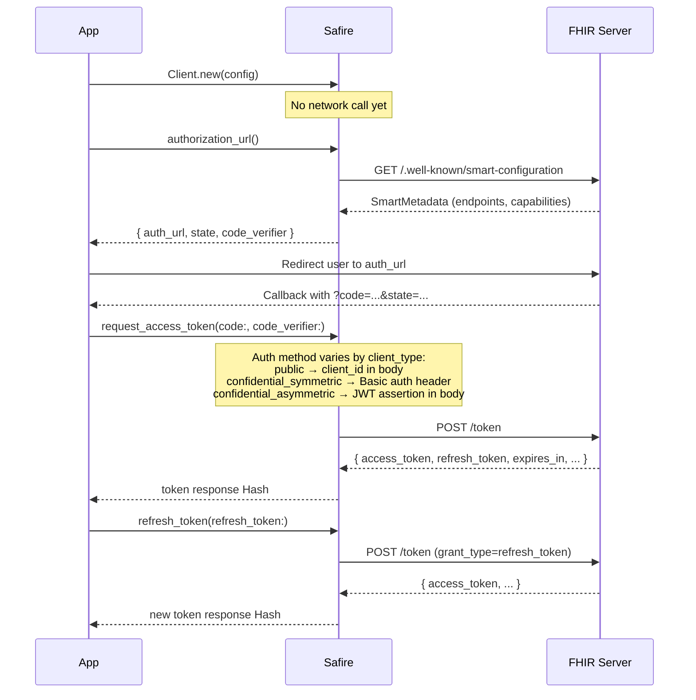

# SMART on FHIR

This section provides step-by-step guides for implementing SMART on FHIR authorization flows with Safire.

## Available Workflows

| Workflow | Description |
|----------|-------------|
| [SMART Discovery]() | Fetching and using SMART configuration metadata |
| [Public Client]() | Authorization flow for browser-based and mobile applications |
| [Confidential Symmetric Client]() | Authorization flow for server-side applications with client secrets |
| [Confidential Asymmetric Client]() | Authorization flow using private_key_jwt (RSA/EC key pair) |
| [POST-Based Authorization]() | Sending the authorization request as a form POST (`authorize-post` capability) |

## Choosing a Client Type

```
Is your application a server-side web application
that can securely store credentials?
        │
        ├── YES → Can you use asymmetric key pairs (RSA/EC)?
        │         │
        │         ├── YES → Confidential Asymmetric Client
        │         │         (Uses private_key_jwt with signed JWT assertions)
        │         │
        │         └── NO  → Confidential Symmetric Client
        │                   (Uses client_secret with HTTP Basic auth)
        │
        └── NO  → Public Client
                  (Uses PKCE only, no client secret)
```

## Common Flow

All SMART authorization flows follow this general pattern. The key differences between client types are in how they authenticate during token exchange and refresh.


